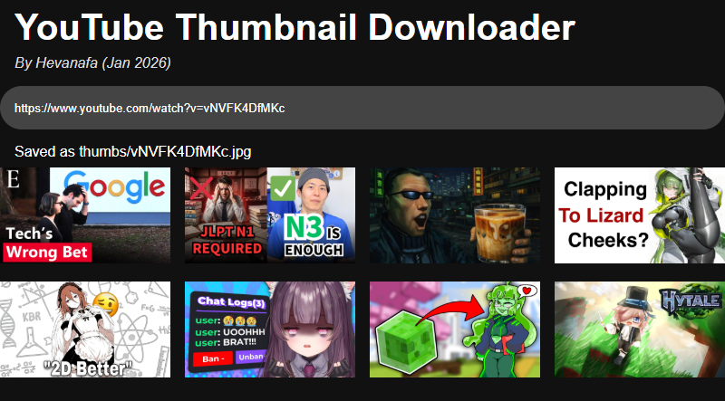

#

A project to download thumbnails from YouTube.  I made this for 'research purposes'

Supported URLs:

- `https://www.youtube.com/watch?v=videoID`
- `https://youtu.be/videoID`
- `https://www.youtube.com/shorts/videoID`

## Requirements

- [Bun](https://bun.com/)
- Any editor that supports React, TypeScript & TSX syntax

## Setup

Since the frontend & backend are separated, using `bun i` in both folders after cloning is necessary

## Running

Frontend layer: `bun run start`

Backend layer: `bun .\server.ts`

The backend layer automatically creates a SQLite database `thumbnails.db` on start
